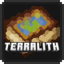

  
  <h1 align="center">Antique Atlas - Terralith Patch</h1>
  <h2 align="center">
    Vizualize Terralith biomes in Antique Atlas.
  </h2>

  

    A Minecraft Resource Pack that provides texture mappings for Antique Atlas to handle Terralith biomes.

## Download

All versions can be downloaded from the [GitHub Releases page](https://github.com/nitodeco/terralith-antiqueatlas-patch/releases).

This resource pack is also available on [Modrinth](https://modrinth.com/resourcepack/antique-atlas-terralith-patch).

## Contributing

If you want to contribute to this project, awesome! Feel free to open an issue or fork the repository and create a pull request. See more in [CONTRIBUTING](CONTRIBUTING) file.

## License

This project is licensed under the MIT License, which means you can use and distribute it for free. See the [LICENSE](LICENSE) file for details.
